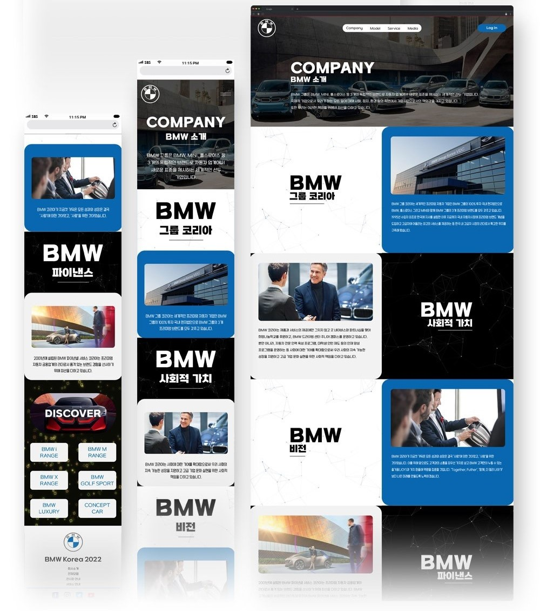

 

### 💻 Tech Stack 💻

  
  
  
  

  

 

### ⚒️ Tools ⚒️

  
  
  
  

 

### 📃 Web Site 📃
### [BMW](http://evergiver97.dothome.co.kr/bmw/index.html)

### ⏱️ 작업 기간 ⏱️
- 기획 9일
- 표현 10일
- 개발 19일

### 🧑‍💻 비주얼 스킬 🧑‍💻
1. UI/UX 설정 및 활용
2. 사진 리터칭 활용
3. 타이포그래피 활용
4. 디지털 합성 활용
5. HTML5&CSS3 활용
6. jQuery&JavaScript 활용
7. 웹폰트 활용
8. SVG&Canvas 활용
